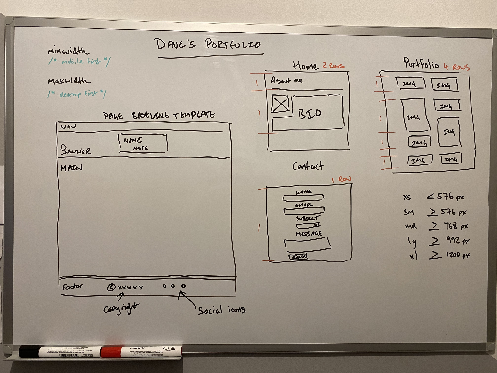
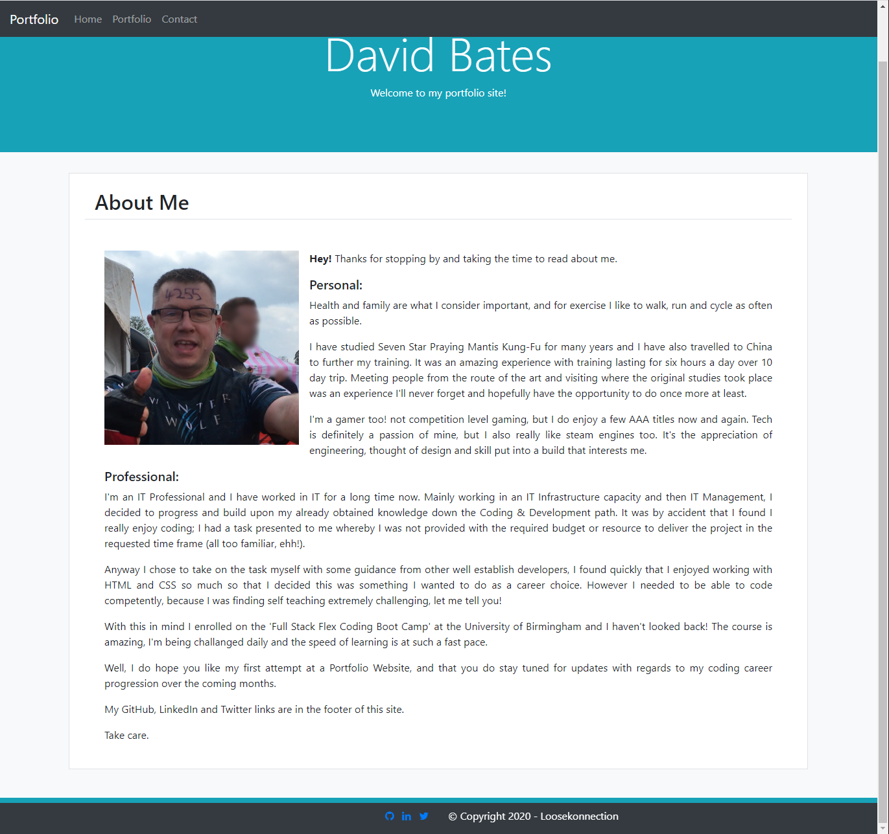
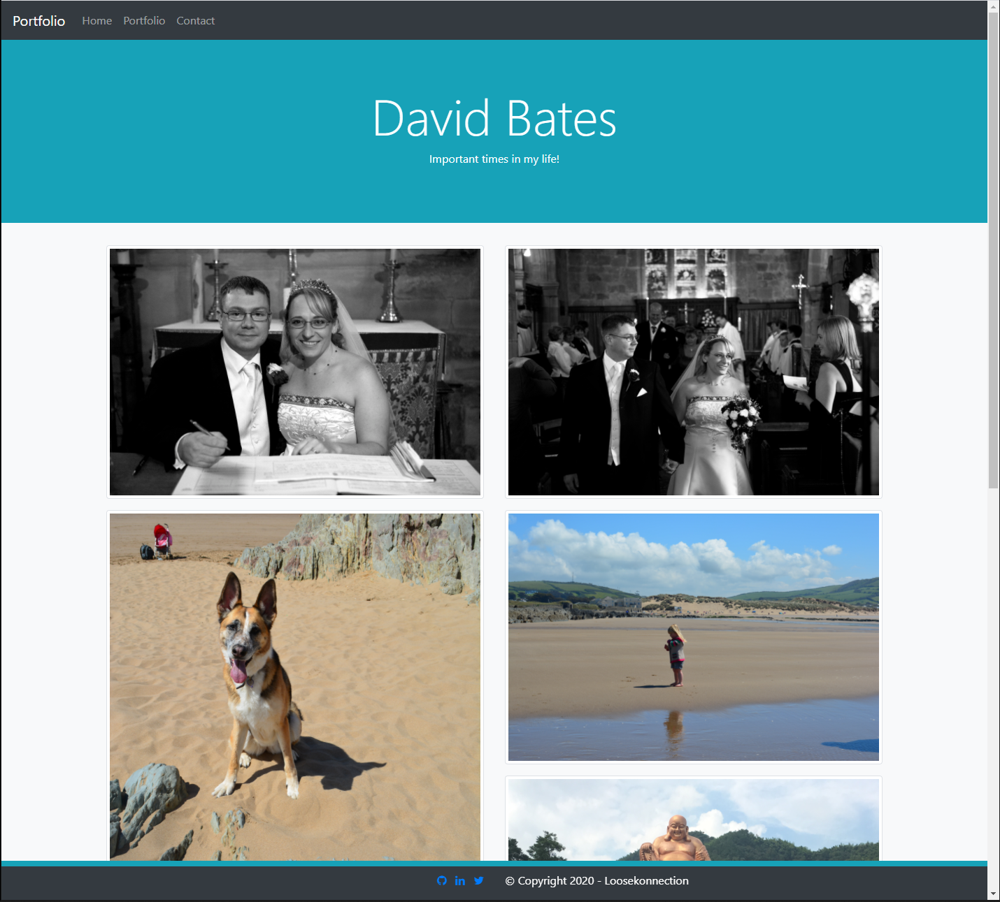
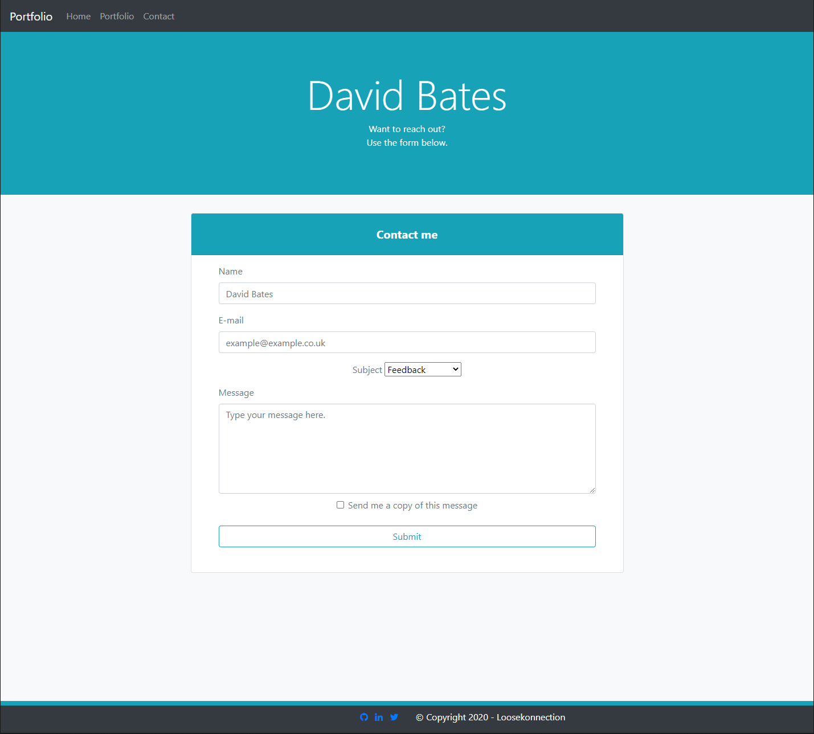

# Portfolio Site with Responsive Design

## Approach

Following the directions of the provided README file, I whiteboarded a rough outline of the portfolio site I needed to create to meet the homework requirements. This helped me visually identify the `sections`, `containers`, `rows` & `columns` that I needed to create.

*   NAV
*   Banner
*   Main
*   Footer



I then created the following repository on GitLab:

*   [ResponsivePortfolio](https://github.com/Loosekonnection/CodeRefactor)

After cloning the above respository, I created the following files locally and then pushed them back to the repo:

*   index.html
*   portfolio.html
*   contact.html

Within each of the local .html files, I created a baseline HTML boilerplate template where I added the Bootstrap CSS and JS links.

from which I began to create each of my whiteboard design elements within the index.html file. 

Using Bootraps site I located a NAV that closely matched my design, I edited this to work within my site and how i wanted it to look.

I wanted to display my name as a ```h1``` in a banner that was consistent across all pages, I found the Jumbotron which was perfect for use as my banner.

I was unable to find a suitable footer, so I created it from scratch using Bootstrap classes that I had looked up. I had whiteboarded placing the copyright on the left and the social media icons on the right, but this didnt look right on the site, so I switched them around on the live site.

Once I had the main structure I worked to make these elements responsive across all devices, I then copied the code to the other .html files, so the code was consistent across the site.

I next began to work with the main content of each page.

I searched for a contact form online and edited one I found to reflect my requirements and site design.

I then created an `img` directory and chose eight images that have significant meaning in my life to create a Portfolio page with. I found the alligment of the portrait and lanscape images difficult to achieve, but this was the design I had chosen to challange myself with. Using online resources I final found a way to align them and for the alignment to remain throughout responsive changes.

I next created the About Me layout in the index.html and design from scratch.
The responsiveness of the paragraph and aligned image was very challanging. I found if I floated the image I was then able to control the layout better.

After finally being happy with the structure and responsive design I ran the code through an HTML Validator, this identified a few rouge tags and typo's that I had to tidy up.

<br>

---
## Final site

*   The site can be viewed using the following link: [Dave's Portfolio Website]()

*   Home Page Screenshot:



*   Portfolio Page Screenshot:



*   Contact Page Screenshot:



<br>

---

## My Findings

The homework focussed on Bootstrap and I was unsure whether I was allowed to use my own CSS styles. The README guide wasn't clear, however it advised to minimise the use of Breakpoints, which are normally defined in a CSS file I thought.

I tired to build the site without using my own CSS file, I found Bootstrap excellent for speed of creating ellements and sections, but limiting on being able to style them.

I tried to create a fixed footer and while I found it easy to create the fixed footer, I could not figure out how to prevent the `<body>` from being hidden behind the footer unless I created my own CSS file and used a `margin-bottom` on the `<body>` element. This was very challanging! Whichever method I chose the Footer would float infront of the body content unless I added margin to the bottom of the body, but even the Bootstrap mb-(1-5) class would give me the result I required.

<br>

---

## Next Steps

I'm looking forward to progressing the site further as my coding skills and project library grows. 

It would be great to get the contact form working with an email service too.

<br>

---

## Credits & Links

*   Bootstrap Documentation [Bootstrap](https://getbootstrap.com/)
*   Bootstrap Code [StackOverflow](https://stackoverflow.com/)
*   Bootstrap Ideas & Examples [M D Bootstrap](https://mdbootstrap.com/)
*   Bootstrap Syntax & Guides [w3schools](https://www.w3schools.com/bootstrap4/default.asp)
*   HTML Code Validation [W3C](https://validator.w3.org/)

<br>

---
<br>


<br>

---
© 2020 Loosekonnection, Working towards being a Full Stack Dev.