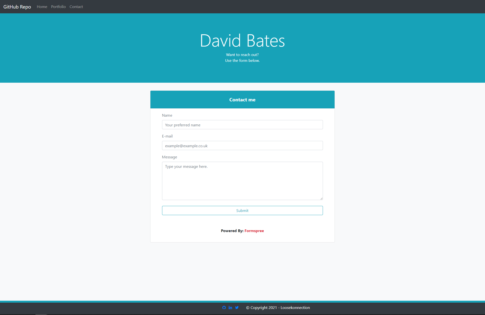

# My Portfolio

My portfolio website with a mobile first responsive design in mind.

*   GitHub Repository [responsivePortfolio](https://github.com/Loosekonnection/responsivePortfolio)
*   GitHub Pages URL [responsivePortfolio](https://loosekonnection.github.io/responsivePortfolio/)
---

 

## Summary

My portfolio site provides a brief summary about me, and then displays a collection of my projects. 

On this site there are links to the site URL's on GitHub and links to the GitHub repositories.

I have setup the contact form that uses [Formspree](https://formspree.io/), so if you wish to reach out I can be contacted via the webform.

Below is a summary of Tech used and some screen shots of the site, then a list of credits who have bee exetremely helpful throughout my coding journey so far.

 

---

 

## Technolgies Used

*   CSS [w3schools.com Learn CSS](https://www.w3schools.com/css/default.asp)

*   HMTL [w3schools.com Learn HTML](https://www.w3schools.com/html/default.asp)

*   Bootstrap 
    *   [w3schools.com Bootstrap4 Tutorial](https://www.w3schools.com/bootstrap4/default.asp)
    *   [Bootstraps Site](https://getbootstrap.com/)
---

 

## Final site

*   The site is responsive and works well across all devices.
*   The site currently consists of three pages.
*   The navbar is consistent across all of the pages with a links to:
    *   GitHub profile 
    *   Home Page
    *   Portfolio Page 
    *   Contact Form Page
*   The footer is also consistent across all pages, it contains links to:
    *   GitHub Profile
    *   Twiiter Profile
    *   LinkedIn Profile. 

*   Home Page Screenshot:

*   Portfolio Page Screenshot:

*   Contact Page Screenshot:

 

---

 

## Next Steps

As I improve in my coding abilities: 

I will continue to produce and update the site with more projects.

I will enhance my existing projects in areas I upskill in. 

I may also integrate some of the projects directly within my portfolio.

While also keeping copies in seperate repositories. 

 

---

## Credits & Links

I have used many different training sites and coding resources throughout the creation of my projects.

Below is a list with links to the sites I used:

*   The Net Ninja:
    *   [Website](https://www.thenetninja.co.uk/)
    *   [YouTube Channel](https://www.youtube.com/channel/UCW5YeuERMmlnqo4oq8vwUpg)
    *   [GitHub](https://github.com/iamshaunjp)

*   Traversy Media 
    *   [YouTube Channel](https://www.youtube.com/channel/UC29ju8bIPH5as8OGnQzwJyA)
    *   [GitHub](https://github.com/bradtraversy)

*   MDN Web Docs 
    *   [JavaScript](https://developer.mozilla.org/en-US/docs/Web/JavaScript)
    *   [jQuery](https://developer.mozilla.org/en-US/docs/Glossary/jQuery)

*   jQuery [write less do more](https://jquery.com/)

*   [w3schools.com](https://www.w3schools.com/)
    *   [HTML Tutorial](https://www.w3schools.com/html/default.asp)
    *   [CSS Tutorial](https://www.w3schools.com/css/default.asp)
    *   [Bootstrap4 Tutorial](https://www.w3schools.com/bootstrap4/default.asp)
    *   [JavaScript Tutorial](https://www.w3schools.com/js/default.asp)
    *   [jQuery Tutorial](https://www.w3schools.com/jquery/default.asp)
    *   [JSON Introduction](https://www.w3schools.com/js/js_json_intro.asp)
    *   [AJAX Introduction](https://www.w3schools.com/js/js_ajax_intro.asp)
    *   [JavaScript HTML DOM](https://www.w3schools.com/js/js_htmldom.asp)
    *   [Node.js Tutorial](https://www.w3schools.com/nodejs/default.asp)

*   [HTML Code Validation](https://validator.w3.org/)
*   [Stackoverflow](https://stackoverflow.com/)

 

---
 

 

---
© 2021 Loosekonnection, Working towards being a Full Stack Dev.
